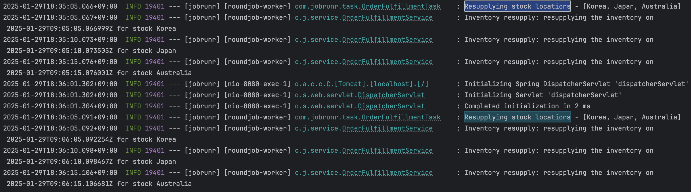

# Jobrunr

- https://github.com/jobrunr/jobrunr

```shell
+------------------------------+
| Tables_in_mydatabase         |
+------------------------------+
| jobrunr_backgroundjobservers |
| jobrunr_jobs                 |
| jobrunr_jobs_stats           |
| jobrunr_metadata             |
| jobrunr_migrations           |
| jobrunr_recurring_jobs       |
+------------------------------+
```

## 스케줄러 사용법 - @Recurring

- 특정 job을 주기적으로 실행하기 위해서 @Recurring를 사용한다.
- 실핼 주기는 cron 표현식으로 지정한다.
- zoneId는 cron 표현식을 해석할 때 사용할 시간대를 지정한다.
- 주기는 실행 시간보다 짧으면 안된다. 
  - 로그에 다음과 같이 찍히며 n번 job 실행됨 (...this means a long gc happened and jobrunr is catching up ...)

```java
// 자동 1분마다 실행되는 Job
@Recurring(id = "daily-resupply", cron = "0 * * * * *", zoneId = "Asia/Seoul")
public void resupply(JobContext jobContext) throws InterruptedException {
    JobDashboardProgressBar jobDashboardProgressBar = jobContext.progressBar(stockLocations.size());

    logger.info("Resupplying stock locations - {}", stockLocations);

    for(String stockLocation : stockLocations) {
        orderFulfillmentService.resupply(stockLocation);
        jobDashboardProgressBar.increaseByOne();
        jobContext.logger().info(String.format("Resupplied stock %s", stockLocation));
    }
}

// 수동
jobScheduler.scheduleRecurrently("every-minute-job", Cron.everyMinute(),
    () -> System.out.println("🚀 1분마다 실행되는 Job!"));

```

- 동작 예시 

